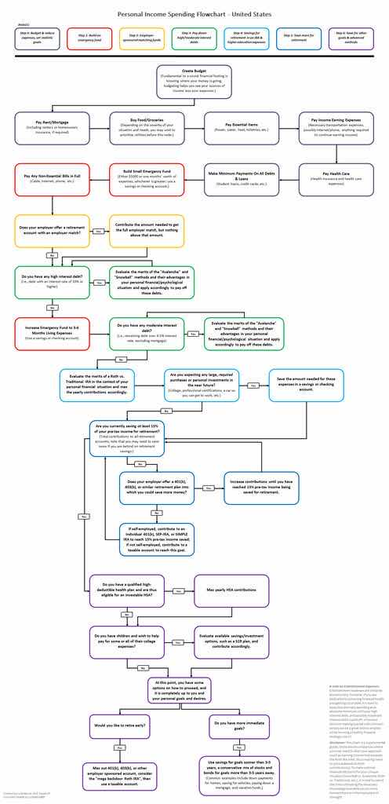

# Pre-Requisites

| Information  | Options  |
|:-------------|:--------:|
| Language     | C Sharp    |
| Framework    | .NET 8.x   |
| Template     | Winforms   |
| Toolset      | WiX Toolset v4  |
| NuGet Packages      | CSVHelper  |
| NuGet Packages      | QuestPDF  |

# Goal:

Take a workflow chart used for Personal Income Spending and turn it into a usable Windows 11 Deskotp App. This way the flowchart is not something you print as a poster and recite as a mantra in your home but can use it on your personal device.

## Key Features:

- CSV/PDF Export
- Save/Load function for profiles via JSON
- Income/Budget sizing customization

## Install from Source Instructions:

Due to size of the release, you will need to install all pre-requisites above via PowerShell but then you can do the following from the root RMoney folder:

- ```dotnet build```
- ```dotnet run```

Once you confirmed it runs, you can compile to an EXE doing the following in the root RMoney folder:

```dotnet publish -c Release -r win-x64 /p:PublishSingleFile=true /p:SelfContained=true```


I did include the MSI installer but due to Github file limits, I had to zip it into multiple 1024 Kb sized files. You can use WinRAR or 7zip to extract.


## FlowChart:



## Review:

- Functionality: 5/5
- Looks: 3/5
    - Text in prompt boxes could be cleaned up and spaced better, maybe font changes. Overall it is readable
- Behavior: 5/5

### Summary:

Cool that it worked. It was in a language I was unfamiliar with but it was fun to optimize. I did do my best to try to force optimization of the language to not include redundancies. I am not saying it is great but it works as it was told to work and can install via MSI and Uninstall via Add/Remove Programs, which was pretty cool to learn.

Overall Fun Putting it Together: 5/5 
